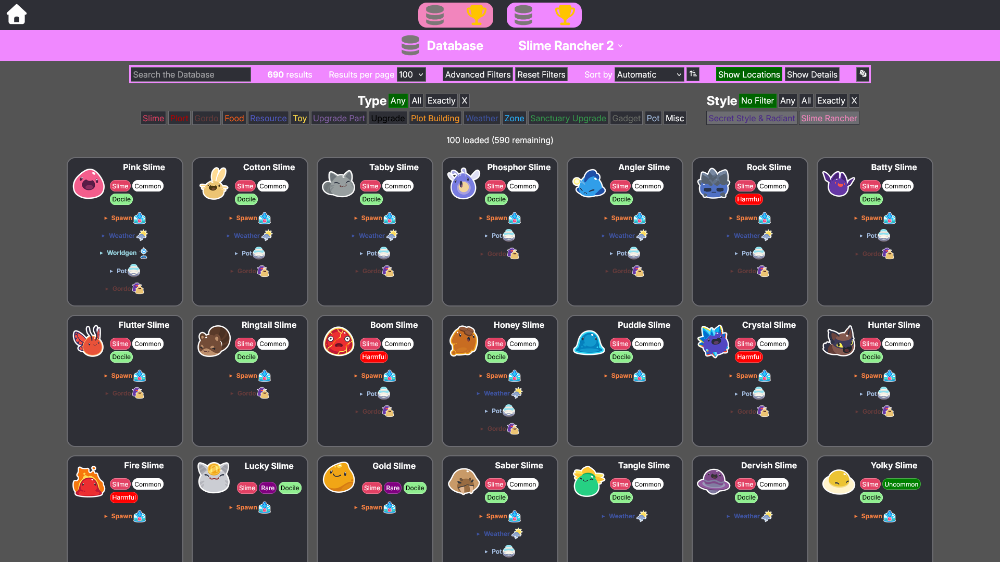
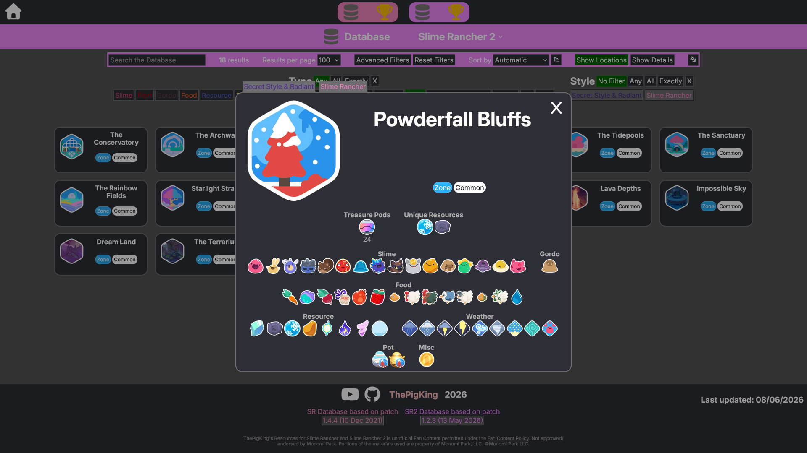
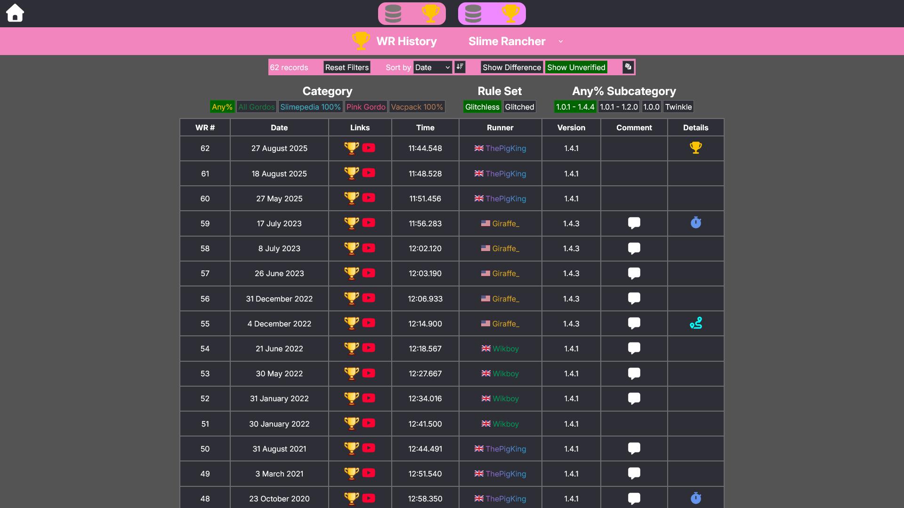
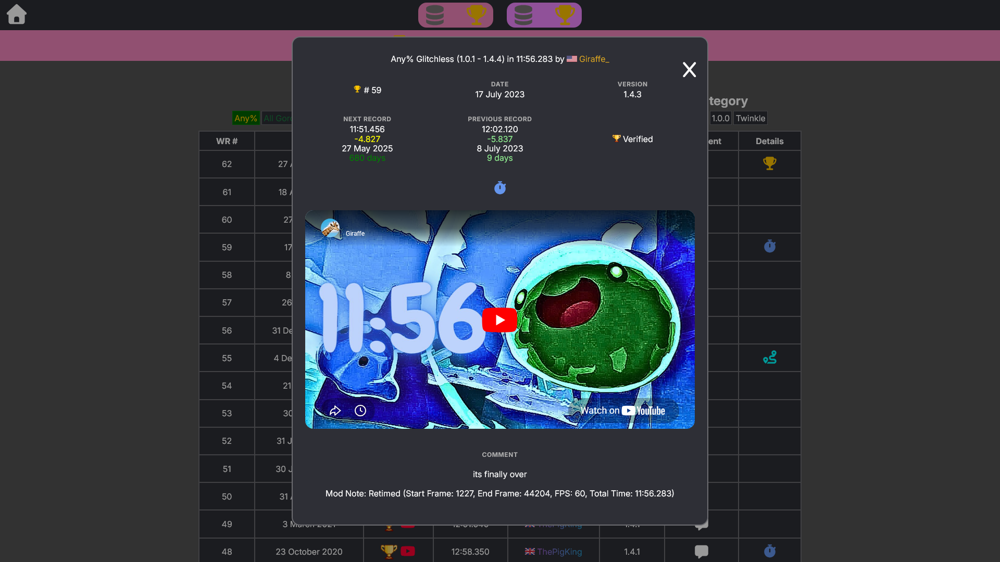

# [the-pig-king.github.io](https://the-pig-king.github.io)

Resources for **Slime Rancher** and **Slime Rancher 2**, with a focus on speedrunning.

## Features

### Database

A searchable and filterable database of items, locations, and more, with over 1000 entries across Slime Rancher and Slime Rancher 2.

  
  

### World Record History

A world record history of Slime Rancher speedruns spanning multiple categories.

  
  

## License

This project is licensed under the MIT License - see the LICENSE.md file for details.

## Acknowledgments

Inspired by:

- [the myekul project](https://myekul.com)
- [Bazaar DB](https://bazaardb.gg/)
